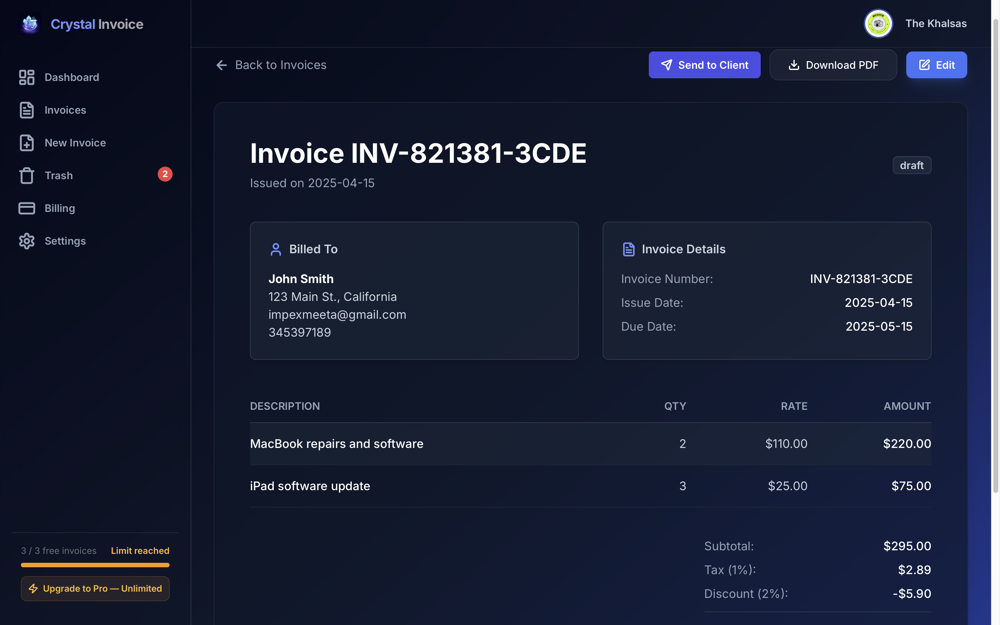
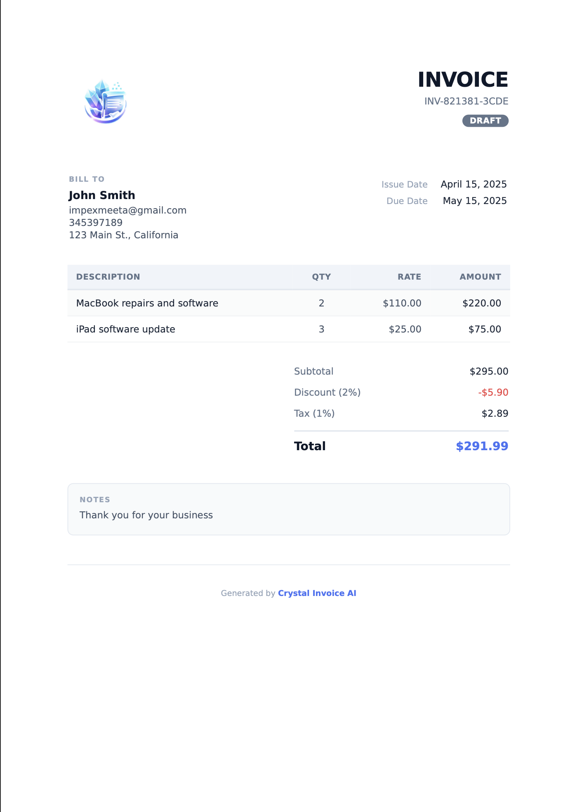
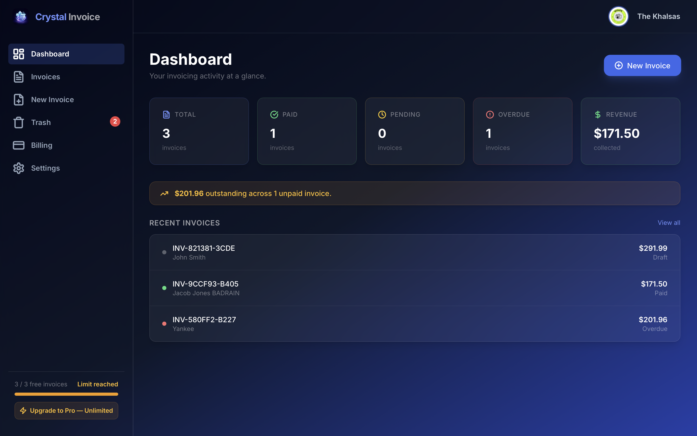
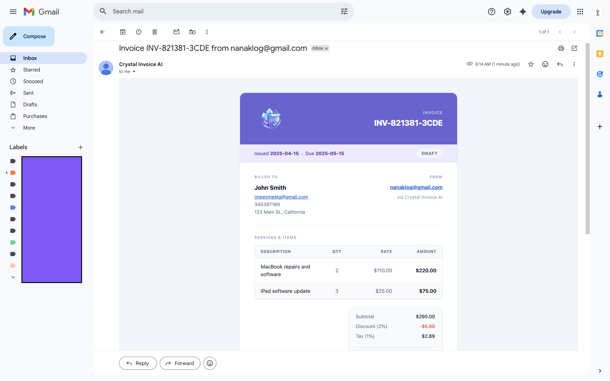

# Crystal Invoice AI

<div align="center">

**[crystalinvoiceai.com](https://crystalinvoiceai.com)** — Live in Production


</div>

---

> ### Say the job. Crystal does the rest.
> **Type or speak → AI builds the invoice → professional PDF → emailed to your client.**
> Free to start. No forms. No fuss.

---

## Table of Contents

- [What It Does](#what-it-does)
- [Key Features](#key-features)
- [How It Works](#how-it-works)
- [Screenshots](#screenshots)
- [Tech Stack](#tech-stack)
- [Architecture](#architecture)
- [Getting Started](#getting-started)
- [Deployment](#deployment)
- [What's Live](#whats-live)
- [Design Decisions](#design-decisions)
- [Challenges Encountered](#challenges-encountered)
- [Roadmap](#roadmap)
- [Owner Operations Guide](#owner-operations-guide)
- [Built With](#built-with)
- [License](#license)

---

## What It Does

Most invoice tools are **form-first**. They expect you to fill in boxes. Crystal Invoice AI is **language-first**. Describe your work the way you naturally would — in plain English or by voice — and the application handles everything else.

**Before Crystal Invoice AI** — the typical freelancer flow:
1. Open a blank template
2. Manually fill in client details
3. Type every line item by hand
4. Calculate tax and discount manually
5. Export a PDF
6. Open email and attach it

**After Crystal Invoice AI** — one step:
> *"Cleaned three offices for Acme Ltd on Tuesday at £120 each. Add 20% VAT."*

That sentence becomes a complete, professional, deliverable invoice.

---

## Key Features

| Feature | Description |
|---|---|
| 🤖 **AI Invoice Generation** | Describe the job in plain English — Crystal extracts client info, line items, rates, tax, and discounts instantly |
| 🎙️ **Voice Input** | Tap the mic, speak your job description, watch the form fill itself — no typing required |
| 🌍 **Multi-Currency Support** | 10 currencies: USD, EUR, GBP, INR, JPY, CAD, AUD, AED, SGD, CHF — one setting propagates everywhere |
| ⏱️ **Default Payment Terms** | Set payment due days once (7 / 14 / 30 / 45 / 60 / 90 or custom) — all new invoices pre-fill the due date automatically |
| 📝 **Default Invoice Footer** | Set a reusable footer note (e.g. bank details, thank-you text) that pre-fills every new invoice — editable per invoice |
| 📄 **Professional PDF Export** | Pixel-perfect A4 PDF via headless Chrome (Puppeteer) — consistent on every device |
| 📧 **Send to Client by Email** | One button emails a styled HTML invoice with the PDF attached; status auto-updates to pending |
| 🏢 **Company Logo** | Upload once; embedded automatically in every PDF and every client email |
| ✅ **Payment Status Tracking** | draft → pending → paid / overdue lifecycle with auto-overdue detection on every load |
| 🗑️ **Trash & Restore** | Soft-delete with full restore capability — nothing lost permanently unless explicitly confirmed |
| 🔑 **Password Reset** | Self-service email token reset — no admin intervention needed |
| 💳 **Stripe Subscription Billing** | Full lifecycle: upgrade → auto-charge → cancel → downgrade, all webhook-driven |
| 📰 **Blog** | Editorial blog at `/blog` — 7 posts, category filter tabs, featured hero card, individual post pages with JSON-LD Article schema and SEO metadata |

---

## How It Works

```
Step 1 — Describe the job
  Type:  "Replaced bathroom tiles for Mr Ahmed. 2 days labour at £250/day, materials £180. 20% VAT."
  OR
  Speak: Tap the mic button and say the same thing.

Step 2 — AI generates the invoice
  Claude Haiku extracts → client name, line items, quantities, rates, tax, discounts
  Every field is pre-filled. Every field is editable.

Step 3 — Deliver it
  Download a pixel-perfect PDF  →  one click
  Email it to the client        →  one button (PDF attached automatically)
```

---

## Screenshots

### AI Invoice Generator
> Describe the job in plain English — AI fills every field instantly.


---

### Invoice Form — Filled and Ready
> Every field editable. Line items, tax, discount, currency, client info.



---

### PDF Output
> Pixel-perfect A4 PDF — consistent on every device and email client.



---

### Dashboard
> Revenue stats, outstanding totals, overdue count, and recent invoice list at a glance.



---

### Email Delivery
> One button sends a styled HTML invoice with the PDF attached directly to the client.



---

### Multi-Currency Support
> 10 currencies supported — switch once and it propagates everywhere.


---

### Invoice Defaults — Payment Terms & Footer
> Set default payment terms (7 / 14 / 30 / 45 / 60 / 90 days or custom) and a reusable footer note once. All new invoices inherit them automatically.


---

## Tech Stack

| Layer | Technology | Hosted On |
|---|---|---|
| Frontend + CRUD API | Next.js 14 (TypeScript, App Router) | Vercel |
| PDF + AI API | Express 4 (Node.js) | Railway |
| Database | PostgreSQL + Prisma 7 (`PrismaPg` adapter) | Neon (serverless Postgres) |
| Authentication | NextAuth v4 (JWT strategy, credentials provider) | — |
| Payments | Stripe Subscriptions + Webhooks | — |
| Email | Resend (verified custom domain) | — |
| AI Model | Anthropic Claude Haiku | — |
| Styling | Tailwind CSS + Framer Motion | — |
| Blog Fonts | Cormorant Garamond (headings) + DM Sans (body) via `next/font/google` | — |

---

## Architecture

The application runs as **two independent services** that work in concert:

```
Browser
  │
  ├── /api/* (Next.js API Routes on Vercel)
  │     ├── Invoice CRUD        → PostgreSQL via Prisma
  │     ├── Authentication      → NextAuth (JWT, bcrypt passwords)
  │     ├── Stripe billing      → Stripe API + webhooks
  │     └── Email delivery      → Resend API
  │
  └── Express Server (Railway)
        ├── POST /api/ai/generate   → Anthropic Claude Haiku
        └── POST /api/pdf/generate  → Puppeteer (headless Chrome)
```

**Why two backends?**

- Puppeteer (headless Chromium) and the Anthropic API are computationally expensive and slow. Running them inside a Next.js serverless function would hit Vercel's 10-second timeout and memory ceiling.
- Separating them into a long-running Express process on Railway removes both constraints and allows the PDF/AI layer to scale independently.
- The Next.js layer stays lean, fast, and stateless.

**Key decisions:**

- Prisma 7 uses the `PrismaPg` adapter — no `url` in `schema.prisma`; connection pooling via `pg.Pool`
- NextAuth uses JWT strategy — no database session table needed
- PDF files are held in Node.js memory with one-time token retrieval (no S3 dependency)
- AI output is constrained via assistant prefill (`{`) to force valid JSON
- Stripe webhooks handle all subscription state transitions — no polling, no cron jobs
- Multi-currency is stored per-invoice in PostgreSQL and propagates to the PDF, email, dashboard, and trash in a single settings change

---

## Getting Started

**Prerequisites:** Node.js ≥ 20.19.0, a running PostgreSQL instance (or a free [Neon](https://neon.tech) project)

```bash
# 1. Clone the repo
git clone https://github.com/gbadrain/crystal-invoice-ai.git
cd crystal-invoice-ai

# 2. Install dependencies
npm install

# 3. Set up environment variables
cp .env.example .env
# Fill in the values — see the table below

# 4. Push schema to database
npx prisma db push

# 5. Start both servers (Next.js :3000 + Express :3001)
npm run dev:all
```

### Environment Variables

All variables are documented in `.env.example` with setup instructions. Quick reference:

| Variable | Required | Description |
|---|---|---|
| `DATABASE_URL` | ✅ | PostgreSQL connection string (pooled) |
| `DATABASE_URL_NEON_DIRECT` | Production only | Non-pooled URL — needed to run Prisma migrations on Neon (avoids P1002 advisory lock timeout) |
| `NEXTAUTH_SECRET` | ✅ | Random 32-byte secret — `openssl rand -base64 32` |
| `NEXTAUTH_URL` | ✅ | Your deployment URL (e.g. `https://crystalinvoiceai.com`) |
| `ANTHROPIC_API_KEY` | ✅ | Claude Haiku API key — [console.anthropic.com](https://console.anthropic.com) |
| `RESEND_API_KEY` | Optional | Resend email key — billing/email UI hidden if absent |
| `RESEND_FROM` | Optional | Verified sender address (e.g. `Crystal Invoice AI <noreply@yourdomain.com>`) |
| `STRIPE_SECRET_KEY` | Optional | Stripe secret key — billing UI hidden if absent |
| `NEXT_PUBLIC_STRIPE_PUBLISHABLE_KEY` | Optional | Stripe publishable key |
| `STRIPE_WEBHOOK_SECRET` | Optional | Stripe webhook signing secret |
| `STRIPE_PRO_PRICE_ID` | Optional | Recurring price ID from Stripe (starts with `price_`) |
| `NEXT_PUBLIC_EXPRESS_URL` | Optional | Railway Express URL — PDF/AI fall back to localhost if absent |
| `NEXT_PUBLIC_APP_URL` | Optional | App base URL (defaults to `http://localhost:3000`) |

> **Stripe and Resend are fully optional for local development.** The app degrades gracefully — billing and email features are hidden rather than throwing errors.

---

## Deployment

The project deploys as two separate services:

| Service | Platform | Config file |
|---|---|---|
| Next.js (frontend + API) | Vercel | `vercel.json` |
| Express (PDF + AI) | Railway | `railway.toml` |

Vercel's build command runs `npx prisma generate && next build` — Prisma client generation is part of the build step, not a separate CI step.

Set `NEXT_PUBLIC_EXPRESS_URL` on Vercel to point to your Railway deployment URL. All PDF and AI requests are proxied through this variable.

---

## What's Live

All features below are implemented, tested, and running in production at [crystalinvoiceai.com](https://crystalinvoiceai.com):

- [x] User registration, email/password authentication
- [x] Self-service password reset (email token) and in-settings change-password
- [x] Full invoice CRUD — create, edit, view, soft-delete, restore, permanent delete
- [x] AI invoice generation via Claude Haiku (text and voice input)
- [x] Voice input via Web Speech API — live "Listening…" indicator, tap to stop
- [x] **Multi-currency support** — 10 currencies, one setting, instant propagation everywhere
- [x] Professional PDF generation via Puppeteer (Railway Express server)
- [x] Email delivery via Resend — styled HTML invoice + PDF attachment, verified custom domain
- [x] Company logo — uploaded once, stored in DB, embedded in PDF and email automatically
- [x] Auto overdue detection — pending invoices past due date promote to `overdue` on list load
- [x] Payment status lifecycle — draft → pending → paid / overdue
- [x] Trash & restore — soft delete, individual or bulk restore, permanent delete with confirmation
- [x] Stripe subscription billing — **live payments active** ($9/month, auto-renewal)
- [x] In-app subscription management — Cancel Plan, Keep Pro, scheduled-cancellation banner
- [x] Stripe Customer Portal — card updates, invoice history, full billing management
- [x] Freemium enforcement — free tier capped at 3 invoices; Pro users unlimited
- [x] Dashboard with revenue stats, outstanding totals, overdue count, and recent invoice list
- [x] SEO-optimized landing page — meta title/description, structured JSON-LD schema, 19 targeted keywords
- [x] Currency showcase strip on landing page — all 10 supported currencies displayed prominently
- [x] Multi-currency FAQ, feature card, and plan highlights on landing page
- [x] Invoice Defaults — set default currency, payment terms (7/14/30/45/60/90 days or custom), and footer note once; all new invoices inherit them automatically
- [x] Open Graph metadata — branded OG image (`/og-image.png`) for correct WhatsApp, Twitter, and social link previews
- [x] Support email — `support@crystalinvoiceai.com` live, forwarded to owner inbox via ImprovMX
- [x] Contact link in landing page footer → `support@crystalinvoiceai.com`
- [x] **Blog system** — `/blog` index with category filter tabs (All, Cash Flow, Growth, Industry, Guides, Finance, How It Works), featured hero card, 3-column responsive grid
- [x] **7 blog posts** — real content covering cash flow, invoicing strategy, AI in 2026, tax, and freelancer guides; authored by Gurpreet Singh Badrain
- [x] **Blog post pages** — `/blog/[slug]` with `generateStaticParams`, `generateMetadata`, JSON-LD Article schema, gold editorial aesthetic (Cormorant Garamond + DM Sans fonts)
- [x] **"From the Blog" landing section** — 3-card teaser before footer with gold accents, links to `/blog`
- [x] `CLAUDE.md` — developer guide for Claude Code with architecture overview and dev commands

---

## Design Decisions

### The entry point is language, not a form

The entire product was designed around one user action:

> *"I fixed two boilers at £200 each for James at 14 Clover Lane. Add 20% VAT."*

That sentence contains a complete invoice. The AI is the **entry point**, not a helper buried in settings. The first thing a user sees when creating an invoice is a plain-text box and a microphone button — not a form.

### AI output is validated, not trusted

Claude Haiku is fast and cost-effective. Its JSON output is not perfectly consistent across all inputs. A dedicated parser (`src/utils/ai-parser.ts`) validates every field the model returns: dates are enforced as ISO format, rates are clamped to 0–100%, totals are recalculated independently, and line item IDs are regenerated client-side. The AI provides intent; the application provides correctness.

### Multi-currency: one setting, instant everywhere

Currency is stored as a column on the `invoices` table. When a user changes their default currency in Settings → Invoice Defaults, the application runs a `prisma.$transaction` that updates the user record and batch-updates every existing invoice in a single atomic operation. From that point, all invoice views, PDF exports, client emails, dashboard stats, and the trash page all read `invoice.currency` and format amounts accordingly — no manual editing required.

### PDF via Puppeteer, not a browser library

Browser-based PDF libraries produce inconsistent output across fonts and layout. Puppeteer (headless Chromium) uses the same rendering engine as Chrome's print dialog, producing pixel-perfect PDFs. The binary is held in Node.js memory with a one-time download token and purged automatically — no S3 bucket needed.

### Logo in email — no CID attachments

Gmail ignores CID inline attachments and renders them as file attachments. The logo is served via a public (no-auth) HTTPS endpoint (`/api/public/logo/[id]`) and referenced as a standard ``. A versioned query parameter (`?v=<updatedAt timestamp>`) busts Gmail's aggressive image proxy cache whenever the logo changes.

### Stripe webhooks own all subscription state

Every subscription state transition — upgrade, renewal, cancellation, downgrade — is triggered by a Stripe webhook event, not by user-facing API calls. This means the database is always consistent with Stripe's billing state, even if the user closes the browser mid-checkout or if a payment fails silently.

---

## Challenges Encountered

### Prisma 7 — Breaking Changes
Prisma 7 removed the `url` field from the `datasource` block in `schema.prisma`. The connection string must now be provided via a separate `prisma.config.ts` file and the `PrismaPg` adapter. This was a non-obvious breaking change requiring a complete rearchitecture of the database connection layer.

### Next.js 14 Router Cache — Silent Stale State
After sign-in, calling `router.push('/')` appeared to do nothing — the user remained on the unauthenticated view. Root cause: Next.js 14 serves a cached RSC payload for same-URL navigations, bypassing the server entirely. Fix: use `window.location.href = '/'` — a full HTTP request — which forces the server to re-evaluate the session.

### Browser Autofill and SSR Hydration
Password manager autofill was being wiped on the landing page sign-in form. Cause: React hydration touches input DOM nodes and clears values that autofill has already injected. Fix: extracted the sign-in card into its own component loaded via `next/dynamic({ ssr: false })` — making it entirely client-rendered, bypassing hydration interference.

### Puppeteer in a Containerised Environment
Puppeteer requires a full Chrome installation. In Docker on Railway's Node.js 22 slim image, several native dependencies (`libasound2`, `libgbm1`, `libxss1`) are absent by default. Each missing dependency is a silent launch failure. The Dockerfile was built incrementally to identify and install each required system package.

### Prisma Migration Recorded but Column Not Created
A `prisma migrate dev` run recorded the migration in `_prisma_migrations` but the `ALTER TABLE` never executed — the column was missing from the live table. Root cause: `prisma migrate deploy` uses a PostgreSQL advisory lock (`pg_advisory_lock`) which times out on Neon's serverless connection pooler (P1002). Fix: execute the `ALTER TABLE ... ADD COLUMN IF NOT EXISTS` directly via `node-pg` against the non-pooled `DATABASE_URL_NEON_DIRECT` connection.

### Stripe Keys — Trailing Newline Corruption
Using `echo "value" | vercel env add` appends a trailing newline to API keys. Stripe's SDK treats this as a malformed key and fails with a cryptic connection error. Fix: always use `printf '%s' 'value' | vercel env add`.

### Stripe Test → Live Mode Migration
Customer IDs created in Stripe's test mode are siloed from live mode. When the application was switched to live keys, the database still held test-mode customer IDs. Fix: cleared `stripeCustomerId` and `stripeSubscriptionId` from affected user records so the checkout flow could create fresh live-mode customer IDs on the next real payment.

### Next.js File-Convention OG Image Override
Next.js App Router gives `opengraph-image.tsx` (file-convention metadata) higher priority than explicit `images` arrays in `layout.tsx`. An `opengraph-image.tsx` file silently overrode the explicitly declared OG image — the live page served a broken dynamic route URL instead of the intended static image. Fix: deleted `opengraph-image.tsx` entirely and served the branded OG image as a static file in `public/og-image.png`. Social preview confirmed via `curl` before testing on WhatsApp.

### CORS Across Two Origins
The Express backend (Railway) needs to accept requests from the Next.js frontend (Vercel). With dynamic Vercel preview URLs, a static allowlist was insufficient. Solution: explicitly whitelist the production Vercel origin via `NEXT_PUBLIC_APP_URL` and allow all origins in development.

---

## Roadmap

The core loop — plain English to delivered invoice — is complete and live. These are the natural next steps:

### Near-Term
- **PWA / Mobile** — installable Progressive Web App; same voice-to-invoice on-site, no laptop needed
- **Client Address Book** — save and reuse client profiles; no retyping names and addresses
- **Recurring Invoices** — schedule auto-generation weekly, monthly, or on a custom cadence
- **Stripe Payment Links** — embed a "Pay Now" button inside the client email; settle online, no bank transfer

### Medium-Term
- **AI Client Memory** — the model learns past rates and clients from history; "invoice John for the usual" becomes a complete invoice
- **Quote → Invoice Conversion** — send a quote first; convert to a live invoice on approval
- **Auto Overdue Reminders** — email reminders at configurable intervals (3, 7, 14 days)
- **Tax Summary Report** — annual income and tax totals formatted for self-assessment

### Longer-Term
- **Accounting Integrations** — QuickBooks, Xero, FreeAgent export
- **Public API** — authenticated REST endpoints for custom integrations
- **Revenue Analytics** — monthly/quarterly charts, client profitability, days-to-pay tracking
- **Multi-Business Profiles** — one account, multiple trading names, each with its own logo and bank details

---

## Owner Operations Guide

Day-to-day management of the live application — no engineering background required.

---

### Viewing Registered Users

**Easiest — Neon Console**
1. Go to [console.neon.tech](https://console.neon.tech)
2. Open your project → **Tables** → select the `users` table

**Via SQL**
```sql
SELECT email, name, "isPro", "createdAt"
FROM users
ORDER BY "createdAt" DESC;
```

> Stripe only shows customers who have paid. Neon is the source of truth for all accounts.

---

### Viewing Payments and Subscriptions

> Always confirm you are in **Live mode** (top-left toggle in the Stripe dashboard) before checking real payments.

| What to check | Where in Stripe |
|---|---|
| All payments | Payments → All transactions |
| Active subscribers | Billing → Subscriptions |
| A specific customer | Customers → search by email |
| Payouts to your bank | Balance → Payouts |
| Monthly revenue | Home → Revenue overview |

---

### Issuing a Refund

1. Payments → All transactions → click the payment
2. Click **Refund payment** (top-right)
3. Choose full or partial → confirm

Refunds appear on the customer's card within **5–10 business days**.

---

### Subscription Lifecycle

**Upgrade:**
User clicks "Upgrade to Pro" → Stripe Checkout → payment captured → webhook → account set to Pro automatically

**Monthly renewal:**
Stripe auto-charges the card → no action required

**Cancellation:**
User clicks "Cancel Plan" → cancellation scheduled for end of billing period → access continues until then → webhook on period end → account downgraded automatically

> Cancellation is never immediate. Customers always retain access for the full period they paid for.

---

### Revenue Breakdown

| | Amount |
|---|---|
| Gross per subscriber | $9.00 / month |
| Stripe fee | ~$0.56 (2.9% + $0.30) |
| Net per subscriber | ~$8.44 / month |

Stripe pays out to your linked bank account on a rolling schedule (typically 2-day rolling once enabled).

---

### Handling Support Emails

All emails sent to `support@crystalinvoiceai.com` are forwarded automatically to your personal inbox via [ImprovMX](https://app.improvmx.com).

- **No separate inbox** — replies are managed directly from your Gmail
- **To reply:** reply normally from Gmail; the customer sees a reply from your personal address
- **To update forwarding** (e.g. change destination email): log in to [app.improvmx.com](https://app.improvmx.com) → Aliases → edit the `support` alias
- **MX records** are set on Namecheap Advanced DNS — do not remove or change them or forwarding will break

---

### Dashboards to Bookmark

| Dashboard | URL | Purpose |
|---|---|---|
| Live site | [crystalinvoiceai.com](https://crystalinvoiceai.com) | The app your customers use |
| Stripe | [dashboard.stripe.com](https://dashboard.stripe.com) | Payments, subscribers, payouts |
| Neon | [console.neon.tech](https://console.neon.tech) | All users and invoice data |
| Vercel | [vercel.com/dashboard](https://vercel.com/dashboard) | Frontend deployment and error logs |
| Railway | [railway.app/dashboard](https://railway.app/dashboard) | PDF/AI server health and logs |
| ImprovMX | [app.improvmx.com](https://app.improvmx.com) | Support email forwarding (`support@crystalinvoiceai.com`) |

---

## Built With

- [Next.js](https://nextjs.org) — React framework (App Router, TypeScript)
- [Prisma](https://prisma.io) — Type-safe database ORM
- [PostgreSQL](https://postgresql.org) — Relational database (hosted on Neon)
- [NextAuth.js](https://next-auth.js.org) — Authentication (JWT strategy)
- [Anthropic Claude](https://anthropic.com) — AI invoice generation (Claude Haiku)
- [Puppeteer](https://pptr.dev) — Headless Chrome PDF rendering
- [Resend](https://resend.com) — Transactional email
- [Stripe](https://stripe.com) — Subscription billing and webhooks
- [Tailwind CSS](https://tailwindcss.com) — Utility-first styling
- [Framer Motion](https://www.framer.com/motion/) — Animations
- [Vercel](https://vercel.com) — Frontend hosting
- [Railway](https://railway.app) — Express server hosting
- [Neon](https://neon.tech) — Serverless PostgreSQL

---

## License

MIT — Copyright © 2026 Gurpreet Singh Badrain. See [LICENSE](LICENSE) for details.
